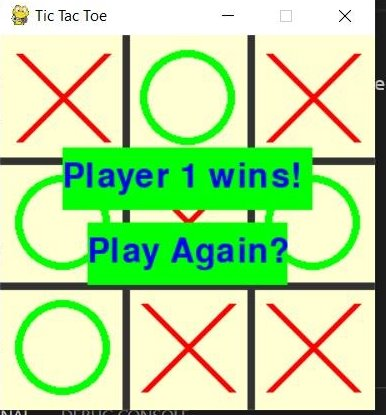
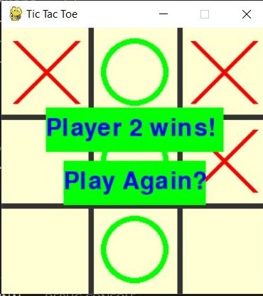
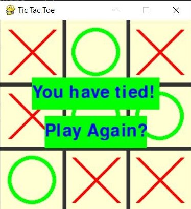

# Tic-Tac-Toe
# About
The project is essentially a simple Tic Tac Toe game where 2 players can play in Visual Studio Code. 
In this game, there are three results: player one wins, player two wins, or a draw
# Documentation 
Pygame is used to initiate and end the game
This project was created using mostly python functions, loops, if statements, and Pygame.

# When player one wins

# When player two wins

# When a draw occurs 

